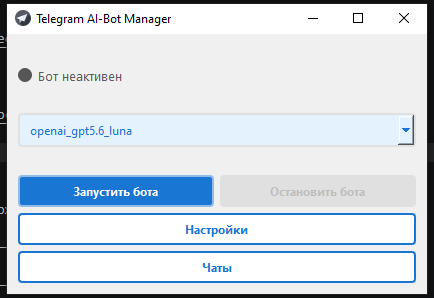
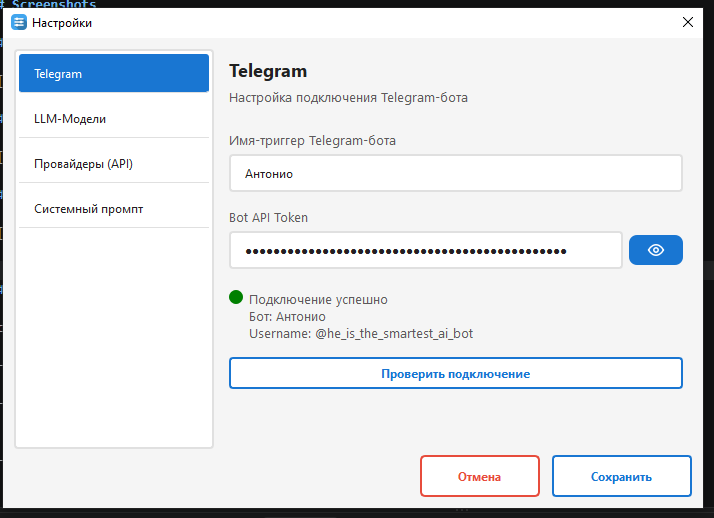
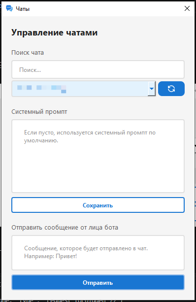

# Telegram AI Companion

Desktop-приложение для управления Telegram-ботом с интеграцией AI-моделей.

Приложение предоставляет графический интерфейс для настройки Telegram-бота, управления AI-моделями и провайдерами, работы с чатами и системными промптами.

## Features

* Управление Telegram-ботом через desktop GUI
* Поддержка AI-моделей через OpenAI-compatible API
* Поддержка нескольких AI-провайдеров
* Управление API-ключами и настройками провайдеров
* Выбор AI-модели из GUI
* Настройка системного промпта
* Отдельные системные промпты для Telegram-чатов
* Управление подключёнными чатами
* Отправка сообщений от имени бота
* Хранение истории сообщений в SQLite
* Асинхронная обработка запросов
* Запуск Telegram-бота в отдельном потоке приложения


## Screenshots

### Main Window



### Settings



### Chat Management




## Architecture

Основная логика приложения разделена на несколько независимых компонентов:

```text
┌──────────────────────┐
│      PySide6 GUI     │
└──────────┬───────────┘
           │
           ▼
┌──────────────────────┐
│      BotRunner       │
│  Bot lifecycle /     │
│  asyncio management  │
└──────────┬───────────┘
           │
           ▼
┌──────────────────────┐
│    TelegramBot       │
│      aiogram         │
└───────┬────────┬─────┘
        │        │
        ▼        ▼
┌────────────┐ ┌───────────────┐
│ AI Agent   │ │ CivitaiClient │
└─────┬──────┘ └───────────────┘
      │
      ▼
┌──────────────────────┐
│   ProviderManager    │
└──────────┬───────────┘
           │
           ▼
┌──────────────────────┐
│ OpenAI-compatible API│
└──────────────────────┘
```


GUI и Telegram-бот работают независимо друг от друга. Telegram-бот использует собственный `asyncio` event loop, запущенный в отдельном потоке, что позволяет не блокировать интерфейс приложения.

## Tech Stack

### Core

* Python 3.12+
* asyncio
* SQLite

### GUI

* PySide6

### Telegram

* aiogram

### AI

* OpenAI-compatible API
* OpenAI
* Groq
* OpenRouter


## Installation

### Requirements

* Python 3.12+
* Telegram Bot Token
* API key одного из поддерживаемых AI-провайдеров
* Доступ к интернету

### Clone repository

```bash
git clone https://github.com/daniles112/telegram_ai_companion.git
cd telegram_ai_companion
```

### Install dependencies

```bash
pip install -r requirements.txt
```

### Run

```bash
python main.py
```

## Configuration

При первом запуске приложение предлагает выполнить первоначальную настройку.

Основные параметры находятся в разделе **Settings**.

### Telegram

Необходимо указать:

* Telegram Bot Token
* имя/триггер бота 
> Если триггер не указан, бот будет реагировать на все текстовые сообщения в подключённых чатах.

Telegram Bot Token можно получить через официального бота `@BotFather`.

### AI Provider

Выберите AI-провайдера и укажите соответствующий API key.

Поддерживаются OpenAI-compatible провайдеры:

* OpenAI
* Groq
* OpenRouter

### AI Model

После настройки провайдера выберите модель, которую бот будет использовать для генерации ответов.

Приложение также позволяет добавлять пользовательские модели.

### System Prompt

Можно задать глобальный системный промпт, который используется ботом по умолчанию.

Для отдельных Telegram-чатов можно установить собственный системный промпт.

## Usage

После первоначальной настройки:

1. Выберите AI-модель.
2. Настройте системный промпт.
3. Запустите Telegram-бота.
4. Добавьте бота в Telegram-чат.
5. Используйте заданный триггер для обращения к боту.


## Limitations

Проект в первую очередь предназначен для личного и небольшого по масштабу использования.

Система не проходила нагрузочное тестирование при большом количестве одновременных запросов, поэтому её производительность и стабильность при высокой нагрузке не оценивались.

Работа приложения также зависит от внешних сервисов — Telegram, AI-провайдеров и Civitai. Их доступность, ограничения API и rate limits могут влиять на работу приложения.

### AI Models and API Limits

Приложение поставляется с несколькими AI-моделями, доступными по умолчанию. Доступ к моделям осуществляется через внешних AI-провайдеров, некоторые из которых предоставляют бесплатные тарифы или free-tier доступ.

Бесплатные модели могут иметь ограничения на количество запросов в день, частоту запросов и другие ограничения со стороны провайдера. Данные ограничения не зависят от приложения и находятся вне его контроля.

Для бесперебойной работы необходимо указать AI-провайдера и модель с достаточными лимитами для предполагаемой нагрузки. Это может быть полностью бесплатный сервис с подходящими лимитами либо платный API с достаточным балансом или доступным объёмом запросов.


